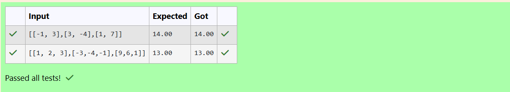
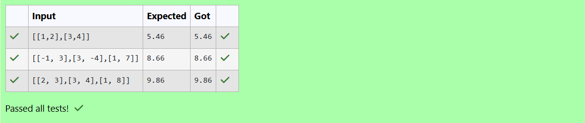
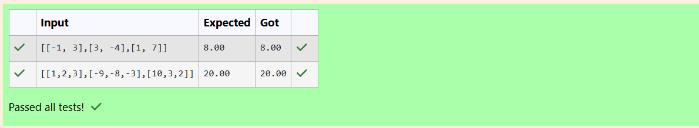

# Norm of a matrix
## Aim
To write a program to find the 1-norm, 2-norm and infinity norm of the matrix and display the result in two decimal places.
## Equipment’s required:
1.	Hardware – PCs
2.	Anaconda – Python 3.7 Installation / Moodle-Code Runner
## Algorithm:
	1. Get the input matrix using np.array()   
    2. Find the 2-norm of the matrix using np.linalg.norm()
	3. Print the norm of the matrix in two decimal places.
## Program:
```Python
# Register No: 24900539
# Developed By: Sharma R
# 1-Norm of a Matrix
```
import numpy as np
mat=eval(input())
twes=np.linalg.norm(mat,1)
print(f"{twes:.2f}")
```


# 2-Norm of a Matrix
```
import numpy as np
mat=eval(input())
twes=np.linalg.norm(mat,2)
print(f"{twes:.2f}")
```


# Infinity Norm of a Matrix
```
def infinity_norm(matrix):
    #Calculate row sums as the sum of absolute values in each row
    row_sums = [sum(abs(element) for element in row) for row in matrix]
    #find and return the maximum row sum 
    return max(row_sums)
    
#Input the matrix in python list format
matrix = eval(input())

#Calculate and display the infinity norm
result=infinity_norm(matrix)
print(f"{result:.2f}")
```


```
## Output:
### 1-Norm of a Matrix
<br>
<br>
<br>

### 2-Norm of a Matrix

<br>
<br>
<br>

### Infinity Norm of a Matrix
<br>
<br>
<br>

## Result
Thus the program for 1-norm, 2-norm and Infinity norm of a matrix are written and verified.
